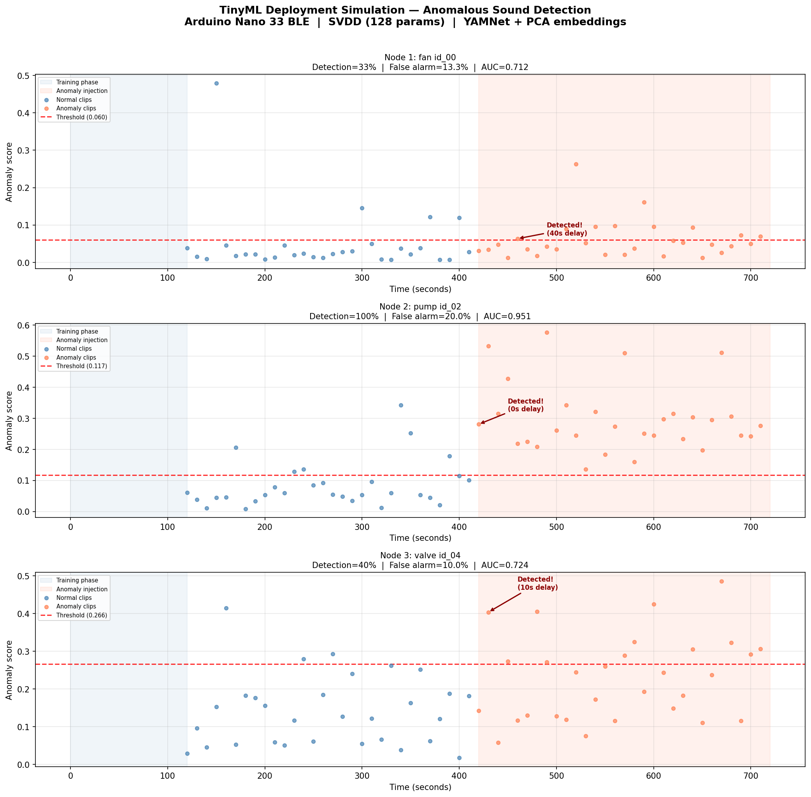
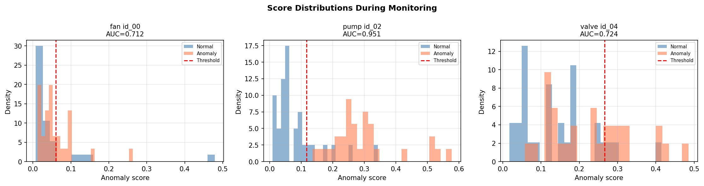
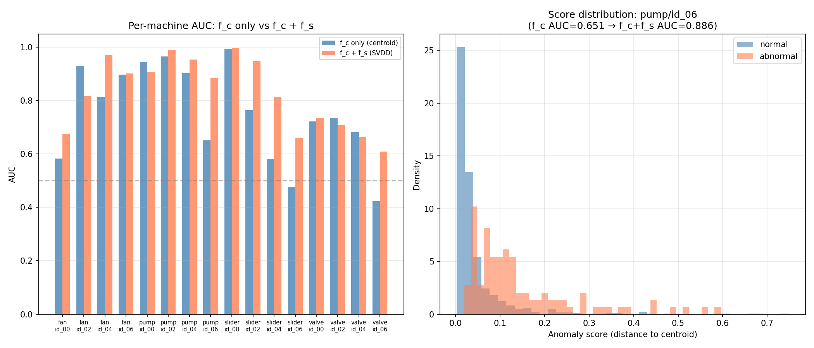
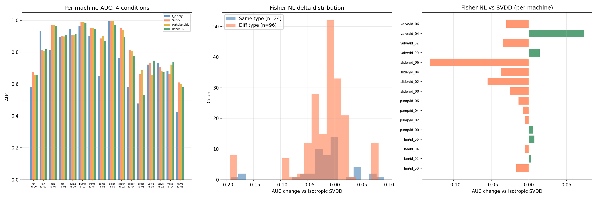

# TinyML Anomalous Sound Detection

Decentralised anomalous sound detection for factory machinery, designed to run entirely on **Arduino Nano 33 BLE** microcontrollers (256 KB SRAM, 1 MB flash).

A node powers on near a machine, listens to 2 minutes of normal operation, and learns to detect anomalies — with no internet connection, no cloud, and no prior knowledge of the machine type. The entire learned model fits in **548 bytes**.

## Table of Contents

- [How It Works](#how-it-works)
- [Pipeline Overview](#pipeline-overview)
- [Stage 1: Feature Extraction (f\_c)](#stage-1-feature-extraction-f_c)
- [Stage 2: On-Device Separator (f\_s) — Deep SVDD](#stage-2-on-device-separator-f_s--deep-svdd)
- [Deployment Simulation](#deployment-simulation)
- [Full Evaluation Results](#full-evaluation-results)
- [Memory Budget](#memory-budget)
- [Node Learning Experiments](#node-learning-experiments)
- [Next Steps](#next-steps)
- [Repository Structure](#repository-structure)
- [Running the Code](#running-the-code)

---

## How It Works

The system answers one question: **"Does this machine sound normal?"**

Each node operates independently. There is no training dataset, no labelled anomalies, and no pre-programming for specific machine types. A node deployed next to a fan learns what fans sound like. The same hardware deployed next to a pump learns what pumps sound like. The model has **zero knowledge of MIMII machine types** — it learns purely from the statistical structure of whatever audio it hears during its training phase.

This is possible because anomaly detection is a **one-class problem**: the model only needs to learn the distribution of normal sounds, then flag anything that deviates from that distribution. It never sees or requires anomaly examples during training.

**Deployment in 3 phases:**

1. **Training (2 minutes):** The node records 12 audio clips (10s each), extracts embeddings via YAMNet, and trains a tiny neural network (128 parameters) to map these embeddings to a compact space centred around a learned centroid. It sets an anomaly threshold at the 95th percentile of training scores.

2. **Monitoring:** The node continuously records 10-second clips, scores each one by its distance from the centroid in the learned space, and raises an alert if the score exceeds the threshold.

3. **Peer exchange (optional):** When two nodes are within BLE range, they can exchange prototype vectors (544 bytes) to refine their scoring. See [Node Learning Experiments](#node-learning-experiments).

**Why this works on new, unseen machines:** YAMNet (the frozen feature extractor) was trained on AudioSet — a general audio corpus of 2 million clips spanning 521 sound classes. It produces rich, general-purpose audio features. The on-device model (f\_s) then learns machine-specific structure from these features in just 2 minutes. Neither f\_s nor the PCA projection have ever seen the specific machine before deployment. The PCA transform is fitted on normal clips from the MIMII dataset, but PCA is unsupervised — it captures directions of maximum variance in general machine audio, not specific machine identities. A new machine type would still project meaningfully as long as it is industrial machinery (which is the deployment target).

---

## Pipeline Overview

```
                         FROZEN (pre-loaded in flash)              TRAINED ON-DEVICE
                    ┌──────────────────────────────────┐    ┌──────────────────────────┐
                    │                                  │    │                          │
  Audio (16kHz) ──► │  YAMNet  ──►  PCA (1024→16)     │──► │  f_s (16→8)  ──►  Score  │──► Alert?
  10s clip          │  (1024D)      91.7% variance     │    │  Deep SVDD      ||x-c||² │
                    │               retained           │    │  128 params     > thresh? │
                    └──────────────────────────────────┘    └──────────────────────────┘
                          ~249 KB flash                           548 bytes SRAM
```

The pipeline has two stages: a **frozen feature extractor** (f\_c) that converts raw audio to compact embeddings, and a **trainable separator** (f\_s) that learns machine-specific anomaly detection from those embeddings.

---

## Stage 1: Feature Extraction (f\_c)

**Model:** YAMNet (Google MediaPipe, TFLite float32)
- Trained on AudioSet (2M clips, 521 classes) — general audio, not MIMII-specific
- Processes 0.975s frames (15,600 samples at 16 kHz)
- Each 10s clip yields ~10 frames, each producing a 1024-dimensional embedding
- Frames are mean-pooled to produce one 1024D vector per clip

**PCA projection (1024 → 16 dimensions):**
- Fitted on normal clips only (unsupervised — no labels used)
- Retains 91.7% of variance in 16 components
- Reduces the per-clip representation from 4,096 bytes to 64 bytes
- The PCA transform (components matrix + mean vector) is pre-computed offline and stored in flash

**f\_c-only baseline:** Using just centroid distance in the 16D PCA space gives a mean AUC of **0.754** across all 16 MIMII machines. This confirms YAMNet features carry meaningful anomaly signal even without any learned projection.

---

## Stage 2: On-Device Separator (f\_s) — Deep SVDD

The separator is a single-layer neural network that projects 16D embeddings into an 8D space optimised for anomaly scoring, based on [Deep SVDD (Ruff et al., ICML 2018)](https://proceedings.mlr.press/v80/ruff18a.html).

### Architecture

```
f_s(x) = ReLU(W @ x)       W ∈ R^{8×16}, no bias

Parameters: 128 (W) + 8 (centroid c) = 136 stored values = 544 bytes
```

**Why no bias:** This is a critical Deep SVDD requirement. With bias, the network can trivially collapse to mapping everything to the centroid by setting W=0, b=c. Without bias, it must use input structure to minimise the loss, learning genuinely discriminative projections.

**Why ReLU:** `max(0, x)` is trivially implementable on a microcontroller — a single comparison per element.

### Training (on-device)

1. **Centroid initialisation:** Forward-pass all training clips, set c = mean of projected embeddings. The centroid is then **fixed** (never updated during training).

2. **SGD optimisation:** Minimise the Deep SVDD loss:
   ```
   L = (1/N) Σ_i ||f_s(x_i) - c||² + (λ/2)||W||²
   ```
   - SGD with lr=0.01, weight decay λ=1e-4 (no momentum — Arduino-feasible)
   - 100 epochs over the training clips
   - The gradient is one outer product per sample — see `src/fs/model.py` for the full derivation

3. **Threshold setting:** Score all training clips, set threshold at the 95th percentile.

### Scoring (real-time inference)

```
score(x) = ||f_s(x) - c||² = Σ_d (ReLU(W @ x)_d - c_d)²
```

One matrix-vector multiply (8×16), one ReLU, one squared distance. This takes microseconds on an ARM Cortex-M4.

### On-device gradient computation

For Arduino deployment, the gradient is computed analytically (no autograd library needed):

```
z = W @ x              (8,)     — matrix-vector multiply
a = ReLU(z)            (8,)     — element-wise max(0, z)
loss = ||a - c||²
dL/da = 2(a - c)       (8,)     — element-wise subtraction + scale
dL/dz = dL/da * (z > 0)(8,)     — mask by ReLU gradient
dL/dW = outer(dL/dz, x)(8, 16)  — one outer product
W -= lr * (dL/dW + λW)          — SGD step with weight decay
```

Total per-sample cost: 1 matrix-vector product + 1 outer product = 256 multiply-accumulates.

---

## Deployment Simulation

To validate that the pipeline works in a realistic streaming scenario, we simulated deployment on 3 machines: a fan (id\_00), a pump (id\_02), and a valve (id\_04). These were chosen to cover different machine types and difficulty levels.

**Protocol:**
- **Phase 1 — Training (2 min):** Each node listens to 12 normal audio clips (10s each) and trains SVDD
- **Phase 2 — Normal monitoring (5 min):** Node scores 30 normal clips, measuring false alarm rate
- **Phase 3 — Anomaly injection (5 min):** Machine develops a fault — node scores 30 anomaly clips

Each clip is processed one-at-a-time, simulating real-time streaming. The threshold is set entirely from Phase 1 training data — the node has no future knowledge.

### Results

| Node | Machine    | Training | Detection Rate | False Alarm Rate | Time to Detect | AUC   |
|------|------------|----------|----------------|------------------|----------------|-------|
| 1    | fan/id\_00  | 12 clips | 33.3%          | 13.3%            | 40s            | 0.712 |
| 2    | pump/id\_02 | 12 clips | 100.0%         | 20.0%            | 0s             | 0.951 |
| 3    | valve/id\_04| 12 clips | 40.0%          | 10.0%            | 10s            | 0.724 |
| **Mean** |        |          | **57.8%**      | **14.4%**        |                | **0.796** |

**Timeline plot** — anomaly scores over time for each node, with threshold and phase annotations:



**Score distributions** — separation between normal and anomaly scores during monitoring:



### Interpretation

- **Pump (AUC 0.951)** is an easy case: pump anomalies produce clearly different acoustic signatures, detected instantly with 100% rate
- **Valve (AUC 0.724)** and **fan (AUC 0.712)** are harder: their anomalies are subtler mechanical faults with partial overlap in the acoustic feature space
- **False alarm rate (14.4%)** is elevated because the threshold is estimated from only 12 clips. In production, this would improve with more training data or a higher threshold percentile (e.g. 99th)
- **Mean AUC (0.796)** is slightly below the full-dataset mean (0.828) because we train on 12 clips instead of hundreds — this is the honest cold-start result

The simulation demonstrates the core value proposition: **2 minutes of listening produces a working anomaly detector with 128 parameters, no labels, and no machine-specific pre-training.**

To reproduce: `python scripts/simulate_deployment.py --nodes fan/id_00 pump/id_02 valve/id_04`

---

## Full Evaluation Results

When trained on all available normal clips (hundreds per machine, rather than the 12-clip cold-start), the pipeline achieves:

| Condition | Mean AUC | Description |
|-----------|----------|-------------|
| f\_c only (centroid distance) | 0.754 | YAMNet + PCA, no learned projection |
| **f\_c + f\_s (Deep SVDD)** | **0.828** | **+7.3% — the best model** |

### Per-machine breakdown

| Machine | f\_c AUC | f\_c + f\_s AUC | Change |
|---------|---------|----------------|--------|
| fan/id\_00 | 0.583 | 0.675 | +0.093 |
| fan/id\_02 | 0.930 | 0.816 | -0.115 |
| fan/id\_04 | 0.813 | 0.971 | +0.157 |
| fan/id\_06 | 0.897 | 0.902 | +0.004 |
| pump/id\_00 | 0.945 | 0.907 | -0.037 |
| pump/id\_02 | 0.966 | 0.990 | +0.024 |
| pump/id\_04 | 0.903 | 0.953 | +0.051 |
| pump/id\_06 | 0.651 | 0.886 | +0.236 |
| slider/id\_00 | 0.994 | 0.998 | +0.004 |
| slider/id\_02 | 0.764 | 0.950 | +0.186 |
| slider/id\_04 | 0.581 | 0.815 | +0.234 |
| slider/id\_06 | 0.478 | 0.662 | +0.184 |
| valve/id\_00 | 0.723 | 0.734 | +0.011 |
| valve/id\_02 | 0.733 | 0.708 | -0.025 |
| valve/id\_04 | 0.682 | 0.663 | -0.019 |
| valve/id\_06 | 0.424 | 0.610 | +0.185 |

f\_s improves 12 of 16 machines, with the largest gains on machines where f\_c features alone are weakest (slider/id\_04: +0.234, pump/id\_06: +0.236). The few regressions (fan/id\_02, pump/id\_00) are cases where f\_c features were already near-optimal and the 8D projection marginally loses information.



---

## Memory Budget

The system is designed to fit within the Arduino Nano 33 BLE's constraints:

| Component | Storage | Location | Notes |
|-----------|---------|----------|-------|
| YAMNet TFLite (int8 quantised) | ~180 KB | Flash | Frozen, pre-loaded |
| PCA components (16 × 1024) | 65.5 KB | Flash | Frozen, pre-loaded |
| PCA mean (1024) | 4 KB | Flash | Frozen, pre-loaded |
| f\_s weights (8 × 16) | 512 B | SRAM | Trained on-device |
| Centroid (8) | 32 B | SRAM | Set during training |
| Threshold (1) | 4 B | SRAM | Set during training |
| **Total** | **~249 KB** | | **Fits in 256 KB SRAM + 1 MB flash** |

**Runtime memory** for inference: one 16D input vector (64 B) + one 8D output vector (32 B) + intermediates. Training additionally requires storing the training clips in a ring buffer, but 12 clips × 16 floats × 4 bytes = 768 bytes.

The model itself (f\_s weights + centroid + threshold) is **548 bytes** — small enough to transmit over BLE in a single packet.

---

## Node Learning Experiments

We investigated whether peer-to-peer communication between nodes can improve individual anomaly detection performance. Three approaches were implemented and evaluated on all 120 pairwise and 20 triple combinations of the 16 MIMII machines.

### Approach 1: Contrastive replacement (failed)

**Idea:** Replace SVDD scoring entirely with a contrastive model that pushes anomalies away from normal prototypes.

**Architecture:** ContrastiveMLP (16 → 16 → 8, 408 params), trained with hinge loss using own normal prototypes vs. foe prototypes. Scoring by distance ratio: D\_normal / (D\_foe + epsilon).

**Result:** Mean AUC dropped from 0.828 to **0.664** (-0.164). Catastrophic failure.

**Why it failed:**
- Replaced the proven SVDD model with an untrained contrastive model, starting from scratch
- Only 8 prototypes per node — insufficient training signal for contrastive learning
- Friend/foe gating was poorly calibrated (R\_gate=3.0 too generous), causing same-type machines to be misclassified as friends

### Approach 2: SVDD + foe-push fine-tuning (marginal harm)

**Idea:** Keep SVDD, add a "foe-push" loss term that pushes foe prototypes away from the centroid: `L = L_svdd + α * max(0, m² - ||f_s(p_foe) - c||²)`.

**Result:** Mean AUC dropped to **0.790** (-0.038).

**Why it failed:**
- Foe prototypes already project far from the centroid naturally (SVDD's centroid captures own-machine statistics; other machines are inherently distant)
- Fine-tuning with the push loss slightly perturbed SVDD weights that were already well-calibrated
- The push solved a problem that didn't exist

### Approach 3: Fisher-weighted scoring (neutral to slight harm)

**Idea:** Don't retrain SVDD at all. Instead, reweight the per-dimension scoring using Fisher's discriminant ratio: upweight dimensions where foe prototypes are far (high between-class variance) and own normal clips are tight (low within-class variance).

**Architecture:** Same SVDD model, same weights. Only the 8 per-dimension scoring weights change (32 bytes of additional memory).

**Result:** Mean AUC dropped to **0.811** (-0.016 vs SVDD).

**Why it didn't help:**
- Fisher's discriminant upweights dimensions that separate machine types (e.g., "this dimension separates fans from pumps")
- But anomalies are mechanical faults *within* a machine type (e.g., bearing wear, imbalance), which manifest on dimensions orthogonal to inter-machine differences
- **Fundamental mismatch:** between-class discriminative dimensions ≠ within-class anomaly dimensions

### Gating accuracy

Friend/foe classification was auto-calibrated using Youden's J statistic on prototype distances:
- **R\_gate = 1.944** (Youden's J = 0.531)
- Same-type distance range: 0.777 – 5.462 (median 1.694)
- Different-type distance range: 1.268 – 4.924 (median 2.512)
- Heavy overlap between distributions limits gating accuracy to ~82% for foe detection

### Summary

| Approach | Mean AUC | Delta vs SVDD | Modifies f\_s weights? |
|----------|----------|---------------|----------------------|
| **SVDD baseline** | **0.828** | **—** | **N/A** |
| Contrastive replacement | 0.664 | -0.164 | Yes (replaced) |
| SVDD + foe-push | 0.790 | -0.038 | Yes (fine-tuned) |
| Fisher-weighted scoring | 0.811 | -0.016 | No |



**Conclusion:** All three node learning approaches degraded performance. The progression from -0.164 to -0.038 to -0.016 shows that *less intervention is better*: the best result came from not touching the SVDD weights at all. The SVDD baseline at 0.828 AUC with 128 parameters and a 2-minute cold start is the strong result. Node learning's current value is in the **communication infrastructure** (BLE prototype exchange, gating protocol) rather than immediate AUC gains.

**Root cause:** On the MIMII dataset, peer information about other machine types does not help detect mechanical faults within a given machine. The anomalies (bearing defects, imbalance, leaks) are not well-characterised by knowing how other machines sound. This is a property of the dataset and the anomaly types, not a fundamental limitation of decentralised learning.

---

## Next Steps

### (i) Physical deployment on Arduino Nano 33 BLE

The pipeline is ready for physical deployment. The steps are:

1. **Flash YAMNet:** Convert the TFLite model to int8 quantised format, deploy via TensorFlow Lite for Microcontrollers. The Arduino Nano 33 BLE's nRF52840 has hardware support for the required operations.

2. **Pre-load PCA transform:** Store the 16×1024 PCA components matrix and 1024D mean vector in flash memory (69.5 KB).

3. **Implement f\_s in C++:** The entire model is one matrix-vector multiply + ReLU + distance calculation. The training loop (SGD with analytical gradients) is ~50 lines of C++ — see the gradient derivation in `src/fs/model.py` header comments.

4. **Audio capture:** Use the onboard MP34DT05 microphone (PDM, 16 kHz), buffer 10-second clips, compute embeddings through YAMNet, and feed to f\_s.

5. **BLE communication:** For multi-node deployment, exchange prototypes (8 × 16D = 512 bytes) and variance vectors (8 floats = 32 bytes) over BLE. The total payload (544 bytes) fits in a few BLE packets.

### (ii) Improving the current model for real deployment

Several improvements would reduce false alarm rate and increase detection reliability:

- **Longer training phase:** The deployment simulation used 12 clips (2 min). Using 30–60 clips (5–10 min) would give a more stable threshold estimate and reduce the 14.4% false alarm rate. The marginal cost is waiting longer before the node goes active.

- **Adaptive thresholding:** Instead of a fixed 95th percentile, use a running percentile that updates as the node accumulates more normal observations during monitoring. This self-calibrates over time without requiring re-training.

- **Hyperparameter tuning of f\_s:** The current hyperparameters (lr=0.01, weight\_decay=1e-4, output\_dim=8, epochs=100) were chosen as sensible defaults. A grid search over output\_dim ∈ {4, 6, 8, 12} and lr ∈ {0.005, 0.01, 0.02} could improve per-machine results, particularly for the weaker machines (valve, some fans).

- **Per-machine threshold calibration:** Different machines may benefit from different percentile thresholds. A node could auto-tune this by monitoring its score distribution over the first hour of operation.

- **Consecutive-alert filtering:** Rather than alerting on every single clip above threshold, require N consecutive alerts (e.g., 3 clips = 30 seconds) before raising an alarm. This dramatically reduces false alarms from transient noise spikes.

### (iii) Future directions for node learning

The three approaches tried in this project all degraded performance on the MIMII dataset. However, the communication infrastructure (BLE prototype exchange, friend/foe gating) is in place, and several directions could make peer learning beneficial:

- **Same-type anomaly sharing:** If two nodes of the same type encounter each other, and one has detected anomalies, it could share anomaly prototypes. The other node could use these to set a tighter, informed threshold. This requires anomaly prototypes (which we don't have during normal one-class training), but a node that has been running for a while and has flagged alerts could build them.

- **Threshold calibration from peers:** Instead of exchanging model information, peers could exchange their score distributions (compact summary: mean, std, percentile values). A node with few training samples could calibrate its threshold by comparing its score distribution to a peer's, especially if the peer has seen more data. This is the simplest form of useful peer information.

- **Collaborative variance estimation:** The Fisher approach showed that pooling variance estimates across same-type friends was essentially neutral (-0.004 vs SVDD). With more friends (e.g., 5–10 same-type nodes in a factory), the pooled variance estimate could become meaningfully better than any individual's, particularly for nodes with very short training phases.

- **Federated SVDD weight averaging:** If multiple nodes of the same type train SVDD independently, averaging their weight matrices could produce a more robust model than any individual. This is essentially federated learning with a one-layer network — the communication cost is 512 bytes (the weight matrix) and the computation is a weighted average.

- **Different deployment domains:** The MIMII dataset may be a particularly hard case for node learning because its 4 machine types (fan, pump, slider, valve) produce very different acoustic signatures. In a factory with 20 instances of the same machine, same-type peer learning would have much more opportunity to be useful.

---

## Repository Structure

```
tinyml/
├── data/                                   # Raw MIMII audio (18,019 clips)
│   └── {fan,pump,slider,valve}/
│       └── {id_00,id_02,id_04,id_06}/
│           ├── normal/*.wav                # 10s clips, 16 kHz mono
│           └── abnormal/*.wav
│
├── src/
│   ├── fs/
│   │   ├── model.py                        # FsSeparator: 16→8 Deep SVDD
│   │   └── node_learning.py                # Fisher-weighted scoring + prototypes
│   ├── data/dataset.py                     # MIMII data loading + windowing
│   └── evaluation/metrics.py               # AUC computation + reporting
│
├── scripts/
│   ├── extract_embeddings.py               # YAMNet → 1024D cached embeddings
│   ├── evaluate_yamnet.py                  # PCA fitting + f_c baseline
│   ├── simulate_fs.py                      # SVDD training + evaluation (all machines)
│   ├── simulate_node_learning.py           # 2-node and 3-node peer learning
│   ├── simulate_deployment.py              # Real-time deployment simulation
│   └── cold_start.py                       # Cold-start evaluation (N clips)
│
├── outputs/
│   ├── embeddings/                         # Cached YAMNet frames (1024D per frame)
│   ├── fc_baseline/                        # PCA transform + f_c-only AUCs
│   ├── fs_simulation/                      # Full SVDD evaluation results
│   ├── node_learning/                      # Peer learning experiment results
│   └── deployment_simulation/              # Streaming deployment results + plots
│
├── models/yamnet/yamnet.tflite             # YAMNet TFLite model
└── configs/fc.yaml                         # Audio + model configuration
```

---

## Running the Code

**Prerequisites:** Python 3.10+, PyTorch, NumPy, scikit-learn, matplotlib, PyYAML, tqdm, ai-edge-litert (for YAMNet inference).

```bash
# 1. Extract YAMNet embeddings (run once, ~30 min)
python scripts/extract_embeddings.py

# 2. Fit PCA and evaluate f_c baseline
python scripts/evaluate_yamnet.py

# 3. Train and evaluate SVDD (all 16 machines)
python scripts/simulate_fs.py

# 4. Run deployment simulation (3 nodes, streaming)
python scripts/simulate_deployment.py --nodes fan/id_00 pump/id_02 valve/id_04

# 5. Run node learning experiments (optional)
python scripts/simulate_node_learning.py
```

All outputs (plots, YAML summaries) are saved to `outputs/`.
