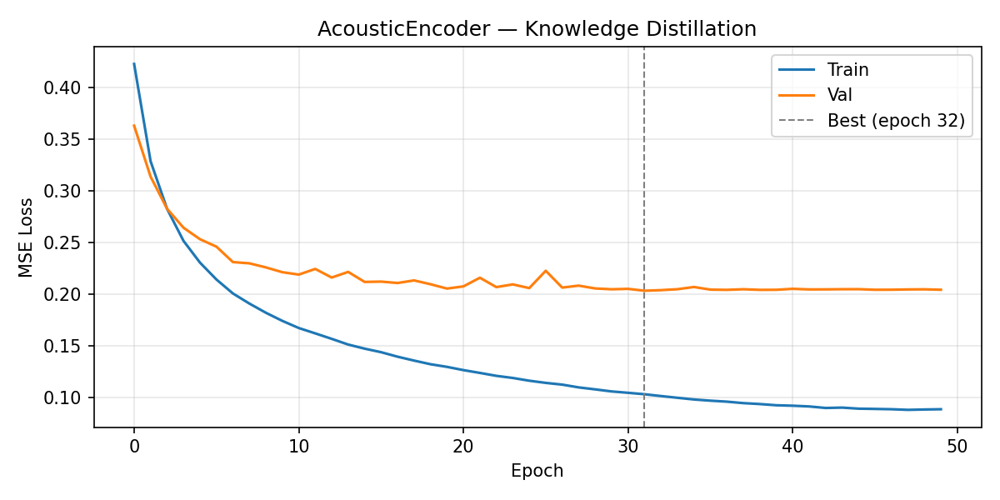
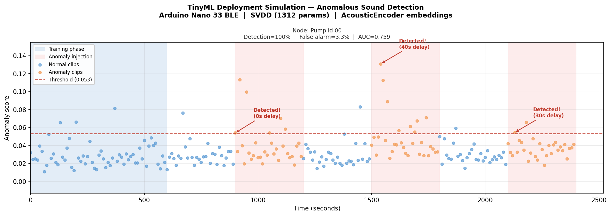
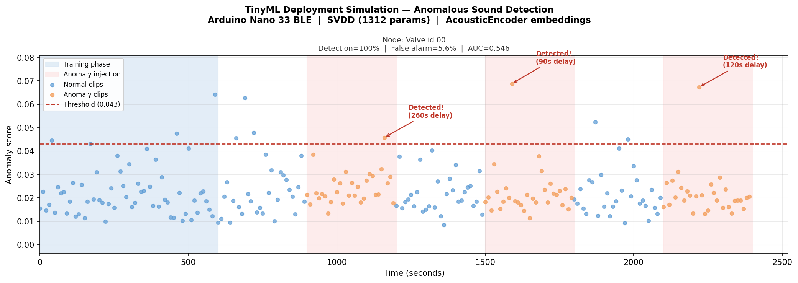

# TinyML Anomalous Sound Detection

Zero-shot anomalous sound detection for factory machinery, running entirely on an **Arduino Nano 33 BLE** microcontroller (2 MB flash, 756 KB SRAM).

A node is placed next to a machine, listens for **10 minutes of normal operation**, trains a tiny anomaly detector on-device, and then continuously monitors for faults — with no internet connection, no cloud, and no prior knowledge of the specific machine type.

---

## Table of Contents

- [How It Works](#how-it-works)
- [System Architecture](#system-architecture)
- [Offline Training Pipeline](#offline-training-pipeline)
- [On-Device Pipeline](#on-device-pipeline)
- [Evaluation Protocol](#evaluation-protocol)
- [Baseline Results](#baseline-results)
- [Deployment Simulation](#deployment-simulation)
- [Memory Budget](#memory-budget)
- [Repository Structure](#repository-structure)
- [Running the Code](#running-the-code)

---

## How It Works

The system answers one question: **"Does this machine sound normal right now?"**

Each node operates independently. There is no training dataset of anomalies, no labels, and no pre-programming for specific machine types. A node placed next to a fan learns what _that fan_ sounds like. The same hardware placed next to a pump learns what _that pump_ sounds like. The model has **zero knowledge of MIMII machine types** — it learns purely from the audio it hears during its 10-minute training window.

This is possible because anomaly detection is a **one-class problem**: the model only needs to learn the statistical distribution of normal sounds, then flag anything that deviates significantly. It never sees or requires anomaly examples.

**Three on-device phases:**

1. **Training (10 minutes):** The node records 60 audio clips (10 s each), extracts 32-dimensional embeddings via the on-device CNN, and trains a small two-layer network (1,312 parameters) to map these embeddings toward a fixed hypersphere centroid. The anomaly threshold is set at the 95th percentile of training scores.

2. **Normal monitoring:** The node continuously scores new 10-second clips by their squared distance from the centroid. Scores below the threshold are classified as normal.

3. **Anomaly monitoring:** When a fault develops, embeddings drift away from the centroid. Scores exceed the threshold and an alert is raised.

---

## System Architecture

The pipeline has two components: a frozen **feature extractor** (f\_c) — a CNN distilled from YAMNet — and a trainable **anomaly detector** (f\_s) — a two-layer Deep SVDD network trained on-device.

```
                         FROZEN (pre-loaded in flash)             TRAINED ON-DEVICE
                    ──────────────────────────────────────    ────────────────────────────
                    │                                    │    │                          │
  Audio (16 kHz) ──► AcousticEncoder (f_c)              ├───► FsSeparator (f_s)         │
  10 s clip          MobileNet V1-style DSC CNN          │    Deep SVDD 32→32→8          │
                     Input: (1, 64, 61) log-mel          │    score = max ||f_s(x)−c||²  ├──► Alert?
                     Output: (1, 32) embedding           │    threshold @ 95th pct       │
                     ~554K params, ~562 KB INT8          │    1,312 params, ~5 KB        │
                    ──────────────────────────────────────    ────────────────────────────
```

**Why a distilled CNN and not YAMNet directly?**

YAMNet is a 4 MB float32 model — far too large for the Arduino's 2 MB flash. Instead, we train a compact MobileNet V1-style CNN (AcousticEncoder) to reproduce YAMNet's embeddings using knowledge distillation on FSD50K. The CNN is then quantised to INT8, giving a ~562 KB model that fits comfortably in flash. On-device, the CNN replaces YAMNet entirely: raw audio goes in, 32D embeddings come out.

---

## Offline Training Pipeline

The offline pipeline runs once on a server/GPU to produce the frozen AcousticEncoder weights that are pre-loaded onto every Arduino. MIMII data is **never used** in this pipeline — it is reserved entirely for evaluation.

```
FSD50K audio ──► [1] YAMNet (4 MB, float32)  ──► 1024D embeddings (N_frames × 1024)
                 [2] PCA (32 components)       ──► 32D targets     (N_frames × 32)
                 [3] AcousticEncoder training  ──► acoustic_encoder.pt
                     MSE(student, PCA targets)
```

### Step 1 — Teacher Preparation (`prepare_teacher.py`)

Runs the YAMNet TFLite model (float32) over every clip in the **FSD50K eval set** to extract 1024-dimensional audio embeddings. Each 10-second clip is sliced into 0.975 s frames (15,600 samples at 16 kHz); YAMNet processes each frame independently.

Then fits **PCA(32 components)** on the resulting embeddings:

- PCA is fitted on FSD50K only — never on MIMII. Fitting on MIMII would be data leakage since MIMII is the evaluation set.
- 32 components explain the dominant directions of variance in general machine audio.
- The PCA components matrix (32 × 1024, 128 KB) and mean vector (1024D, 4 KB) are saved and will be used during student training. They are **not needed on-device** — the student learns to output 32D embeddings directly.

**Output:** `outputs/fsd50k_cache/eval_embeddings.npy` (N × 1024), `outputs/pca/pca_components.npy` (32 × 1024), `outputs/pca/pca_mean.npy` (1024,)

### Step 2 — Mel Spectrogram Cache (`prepare_mels.py`)

Computes log-mel spectrograms for every FSD50K frame in the same order as Step 1, so frame index `i` in the mel cache corresponds exactly to frame index `i` in the embedding cache.

Each frame → `(1, 64, 61)` log-mel spectrogram (64 mel bins, 61 time steps, single channel):

```python
mel = librosa.feature.melspectrogram(frame, sr=16000, n_fft=1024, hop_length=256, n_mels=64)
log_mel = log(mel + 1e-6)    # (64, 61), then add channel dim → (1, 64, 61)
```

**Output:** `outputs/fsd50k_cache/eval_mels.npy` (N × 1 × 64 × 61, ~1.5 GB)

### Step 3 — Student Distillation (`train_student.py`)

Trains **AcousticEncoder** (the on-device CNN) to reproduce the PCA-projected YAMNet embeddings via mean-squared error:

```
Loss = MSE(AcousticEncoder(mel), PCA_project(YAMNet_embed))
```

- Optimiser: AdamW, lr=1e-3, weight decay=1e-4
- Schedule: CosineAnnealingLR over 50 epochs
- Batch size: 256, 90/10 train/val split
- Best checkpoint saved by validation MSE

The student never sees MIMII. It learns to map log-mel spectrograms to the same 32D space that YAMNet+PCA maps audio to — a general-purpose audio feature space that captures acoustic structure useful for anomaly detection.

**Output:** `outputs/student/acoustic_encoder.pt`, `outputs/student/training_curve.png`



---

## On-Device Pipeline

Once flashed, the Arduino runs two models end-to-end on raw microphone audio.

### Feature Extraction: AcousticEncoder (f\_c)

A MobileNet V1-style depthwise-separable CNN that converts log-mel spectrograms to 32-dimensional embeddings.

**Architecture:**

```
Input: (1, 1, 64, 61) log-mel spectrogram  ← 0.975 s audio frame

Stem:   Conv2d(1→32, 3×3, stride=2) + BN + ReLU        → (1, 32, 32, 31)
B1:     DW(32, stride=2) + BN + ReLU                    → (1, 32, 16, 16)  ← SRAM peak
        PW(32→64)        + BN + ReLU                    → (1, 64, 16, 16)
B2:     DW(64, stride=2) + BN + ReLU                    → (1, 64,  8,  8)
        PW(64→128)       + BN + ReLU                    → (1,128,  8,  8)
B3:     DW(128, stride=1) + PW(128→128)                 → (1,128,  8,  8)
B4:     DW(128, stride=2) + PW(128→256)                 → (1,256,  4,  4)
B5:     DW(256, stride=1) + PW(256→256)                 → (1,256,  4,  4)
B6:     DW(256, stride=2) + PW(256→512)                 → (1,512,  2,  2)
B7:     DW(512, stride=1) + PW(512→512)                 → (1,512,  2,  2)
Pool:   AdaptiveAvgPool2d(1)                             → (1,512,  1,  1)
Head:   Linear(512→32)                                   → (1, 32)

Parameters: ~554K
Flash (INT8 TFLite): ~562 KB (weights + INT32 biases + per-channel quant scales)
```

Each 10-second clip is sliced into ~10 frames (0.975 s each). The encoder processes each frame independently, yielding a `(10, 32)` embedding matrix per clip.

**Depthwise-separable convolutions:** Each `DepthwiseSeparableBlock` applies a 3×3 depthwise convolution (one filter per channel) followed by a 1×1 pointwise convolution. This reduces parameters ~8–9× versus a standard convolution with the same channel counts. BatchNorm layers are folded into conv weights during TFLite export, adding zero runtime cost.

### Anomaly Detection: FsSeparator (f\_s)

A two-layer network trained on-device using **Deep SVDD** (Ruff et al., ICML 2018). It maps 32D embeddings into an 8D space where normal sounds cluster around a fixed centroid.

**Architecture:**

```
f_s(x) = ReLU( W₂ · ReLU( W₁ · x + b₁ ) )

W₁ ∈ ℝ^{32×32}, b₁ ∈ ℝ^{32}   (fc1: bias=True)
W₂ ∈ ℝ^{8×32}                  (fc2: bias=False ← required by Deep SVDD)

Parameters: 32×32 + 32 + 32×8 = 1,312
```

**Why no bias on fc2?** Deep SVDD requires the final layer to be bias-free. With bias, the network can trivially satisfy the loss by setting `W₂ = 0`, `b₂ = c` (the centroid), mapping all inputs to the centroid regardless of content. Without bias, the network must actually learn to use the input structure.

**Training (on-device, 10-minute window):**

1. Forward-pass all 60 training clips through f\_c and stack the per-frame embeddings.
2. Initialise centroid `c = mean(f_s(x_i))` over all training embeddings. **Fix c — never update it.**
3. Minimise the SVDD loss with SGD (lr=0.01, weight decay=1e-4, no momentum):
   ```
   L = (1/N) Σᵢ ||f_s(xᵢ) − c||²
   ```
4. Set threshold at the 95th percentile of training scores: `τ = percentile(||f_s(xᵢ)−c||², 95)`.

**Scoring (inference):**

Each clip yields ~10 frames. The clip score is the **maximum** per-frame squared L2 distance from the centroid:

```
score(clip) = max_frame ||f_s(frame_embedding) − c||²
```

Max-frame scoring is more sensitive than mean-pooling: a clip with one anomalous frame (e.g., a brief mechanical knock) will score high even if the remaining frames are normal. A clip scores as anomalous if `score > τ`.

---

## Evaluation Protocol

Evaluation uses the **MIMII dataset** (16 machines: 4 types × 4 IDs). The protocol is designed to mirror deployment as closely as possible.

**For each machine:**

1. Split normal clips 80/20 into training (SVDD fitting) and held-out sets.
2. Fit SVDD on the 80% training split; compute per-frame training scores.
3. Set threshold `τ` at the 95th percentile of **training scores** — not held-out scores. In real deployment, the node has no held-out set; it must set its threshold from the clips it trained on.
4. Evaluate AUC, precision, and recall on **held-out normal + all abnormal clips**.

**Why this matters:** Using held-out normal clips to set the threshold would be data leakage — in deployment, the node has no future normal clips available when deciding where to draw the line. AUC remains valid as a threshold-free metric regardless.

**Metrics:**
- **AUC** (Area Under ROC Curve): threshold-free measure of score separation between normal and anomalous clips. AUC = 1.0 is perfect; 0.5 is random.
- **Precision**: of clips predicted anomalous, how many are actually anomalous.
- **Recall** (Detection Rate): of all anomalous clips, how many are correctly flagged.

---

## Baseline Results

Three baselines are evaluated on MIMII to understand the contribution of each pipeline stage.

| Model | Description | Mean AUC |
|-------|-------------|----------|
| YAMNet only | Raw 1024D → PCA(32D) → centroid distance | 0.696 |
| YAMNet + PCA + SVDD (teacher) | Full teacher pipeline | **0.755** |
| AcousticEncoder + SVDD (student) | Full student pipeline (on-device) | 0.723 |

The student (0.723) is 3.2 points below the teacher ceiling (0.755) — a reasonable gap given that the student CNN has 554K parameters and was trained only on the FSD50K eval subset (~10K clips). The student matches or exceeds the YAMNet-only baseline on most machines.

### Per-Machine AUC

| Machine | YAMNet | Teacher | Student |
|---------|--------|---------|---------|
| fan/id\_00 | 0.547 | 0.571 | 0.632 |
| fan/id\_02 | 0.813 | 0.815 | 0.813 |
| fan/id\_04 | 0.622 | 0.771 | 0.758 |
| fan/id\_06 | 0.782 | 0.842 | 0.878 |
| pump/id\_00 | 0.920 | 0.823 | 0.807 |
| pump/id\_02 | 0.854 | 0.970 | 0.706 |
| pump/id\_04 | 0.896 | 0.968 | 0.964 |
| pump/id\_06 | 0.510 | 0.898 | 0.716 |
| slider/id\_00 | 0.969 | 0.988 | 0.999 |
| slider/id\_02 | 0.661 | 0.688 | 0.692 |
| slider/id\_04 | 0.615 | 0.660 | 0.731 |
| slider/id\_06 | 0.744 | 0.650 | 0.584 |
| valve/id\_00 | 0.383 | 0.483 | 0.514 |
| valve/id\_02 | 0.893 | 0.642 | 0.637 |
| valve/id\_04 | 0.337 | 0.508 | 0.488 |
| valve/id\_06 | 0.596 | 0.799 | 0.644 |
| **Mean** | **0.696** | **0.755** | **0.723** |

Valve machines are consistently the hardest — their anomalies produce subtle acoustic changes that are difficult to separate in the 32D embedding space. Sliders and pumps are generally easier, with several machines achieving AUC > 0.9.

---

## Deployment Simulation

`simulate_deployment.py` validates the full pipeline in a realistic streaming scenario with no access to future data.

### Protocol

For each of the 16 MIMII machines:

1. **Training phase (10 min):** Draw 60 normal clips at random (no replacement). Fit AcousticEncoder embeddings → SVDD → centroid → threshold (95th percentile of training scores).

2. **Repeat 3 rounds:**
   - **Normal monitoring (5 min):** Score 30 normal clips not seen during training. Count false positives (clips scored above threshold).
   - **Anomaly injection (5 min):** Score 30 abnormal clips. Record detection: whether any clip scores above threshold, and how many clips elapsed before the first detection (detection delay in seconds).

Each clip is a fresh random sample with no repetition across the whole simulation. The threshold is fixed from training — the node has no information about future clips.

### Aggregate Results (all 16 machines, 47 rounds)

| Metric | Value |
|--------|-------|
| Detection rate | **97.9%** (46 / 47 rounds detected) |
| False alarm rate | **5.5%** (78 / 1,410 normal clips) |
| Mean detection delay | **47 s** |
| Median detection delay | **20 s** |
| Max detection delay | **260 s** (valve/id\_00, round 1) |

### Interpretation

- **Detection rate (97.9%):** The system catches faults in almost every round. The single missed detection was valve/id\_06 round 1, the hardest machine in the dataset.
- **False alarm rate (5.5%):** One false alarm per ~18 normal clips. In a 5-minute monitoring window with 30 clips, this translates to ~1.7 false alarms per window on average. This is driven by the threshold being estimated from only 60 training clips; a longer training window would give a more stable threshold.
- **Detection delay:** The median delay is 20 seconds (2 clips), meaning for most machines the fault is caught on the first or second anomalous clip. The long tail (max 260 s) comes from valve machines where the anomaly signal is weak and intermittent.
- **One missed detection in 47 rounds** demonstrates the pipeline is robust across diverse machine types with no machine-specific tuning.

Per-machine plots are saved to `outputs/deployment_sim/`. Each plot shows anomaly scores over time with the threshold, phase annotations, and detection delay arrow.

**Example — pump/id\_00 (easy case, instant detection):**



**Example — valve/id\_00 (hard case, high detection delay):**



---

## Memory Budget

The Arduino Nano 33 BLE has 2,048 KB flash and 756 KB SRAM.

### Flash

| Component | Size | Notes |
|-----------|------|-------|
| AcousticEncoder INT8 weights | ~534 KB | 1 byte per weight after quantisation |
| INT32 biases (BN-folded) | ~14 KB | 4 bytes per output channel |
| Per-channel quant scales | ~14 KB | 4 bytes per output channel |
| TFLite flatbuffer metadata | ~10 KB | graph/tensor descriptors |
| Application code | ~50 KB | Arduino sketch estimate |
| **Total** | **~622 KB** | **30% of 2,048 KB budget** |

BatchNorm layers are **folded** into preceding Conv2d weights during TFLite INT8 export, so they contribute no additional flash cost at runtime. The ~14 KB for biases reflects BN-folded biases absorbed into each conv layer.

### SRAM

All sizes are INT8 activations unless noted.

| Component | Inference | Training |
|-----------|-----------|----------|
| TFLite Micro arena (peak activations + scratch + metadata) | ~73 KB | ~73 KB |
| Audio capture buffer (15,600 samples × float32) | ~61 KB | ~61 KB |
| Log-mel spectrogram buffer (1×64×61 × float32) | ~15 KB | ~15 KB |
| f\_s weights + centroid (float32) | ~5 KB | ~5 KB |
| f\_s gradients (SGD, no momentum) | — | ~5 KB |
| f\_s forward activations (for backprop) | — | ~0.4 KB |
| Mini-batch embedding buffer | — | ~1.5 KB |
| Stack + misc | ~16 KB | ~16 KB |
| **Total** | **~170 KB** | **~177 KB** |
| **Budget** | **756 KB** | **756 KB** |

The SRAM peak during activation is at the **B1 depthwise layer**: input `(1, 32, 32, 31)` and output `(1, 32, 16, 16)` must be live simultaneously, totalling 39,936 bytes (~39 KB). This is the constraining activation; all subsequent layers are smaller.

Training uses only **~177 KB / 756 KB (23%)** of SRAM — entirely feasible on-device. SGD with no momentum avoids the 2× memory overhead of Adam (no `m` and `v` vectors).

The TFLite Micro arena must be verified empirically with `RecordingMicroInterpreter::arena_used_bytes()` after TFLite export, as static estimates exclude some scratch buffer overheads.

Run `python scripts/memory_audit.py` for a full layer-by-layer breakdown.

---

## Repository Structure

```
tinyml/
├── data/
│   ├── fsd50k/                          # FSD50K eval audio (for student training)
│   └── {fan,pump,slider,valve}/
│       └── {id_00,id_02,id_04,id_06}/
│           ├── normal/*.wav             # 10 s clips, 16 kHz mono
│           └── abnormal/*.wav
│
├── models/
│   └── yamnet/
│       └── yamnet.tflite               # YAMNet float32 TFLite (4 MB, offline use only)
│
├── src/
│   └── models/
│       ├── cnn.py                      # AcousticEncoder: MobileNet V1-style DSC CNN (f_c)
│       └── separator.py               # FsSeparator: Deep SVDD (f_s) + train_fs/score_clips
│
├── scripts/
│   ├── download_fsd50k.py             # Download FSD50K eval set
│   ├── prepare_teacher.py             # YAMNet → FSD50K embeddings + fit PCA(32D)
│   ├── prepare_mels.py                # FSD50K WAVs → log-mel spectrogram cache
│   ├── train_student.py               # Distil AcousticEncoder via MSE on FSD50K
│   ├── test_yamnet.py                 # Baseline: YAMNet+PCA centroids on MIMII
│   ├── test_teacher.py                # Baseline: YAMNet+PCA+SVDD on MIMII (teacher)
│   ├── test_student.py                # Evaluate AcousticEncoder+SVDD on MIMII (student)
│   ├── simulate_deployment.py         # Streaming deployment simulation (all 16 machines)
│   ├── memory_audit.py                # Flash + SRAM budget audit (static + optional TFLite)
│   └── export_student.py              # Export AcousticEncoder: .pt → ONNX → TFLite INT8 → .h
│
└── outputs/
    ├── fsd50k_cache/                  # eval_mels.npy + eval_embeddings.npy
    ├── pca/                           # pca_components.npy + pca_mean.npy
    ├── student/                       # acoustic_encoder.pt + training_curve.png
    ├── yamnet_baseline/               # results.yaml (YAMNet centroid baseline)
    ├── teacher_baseline/              # results.yaml (YAMNet+PCA+SVDD baseline)
    ├── student_baseline/              # results.yaml (AcousticEncoder+SVDD)
    ├── deployment_sim/                # results.yaml + per-machine plots
    └── export/                        # .onnx, .tflite (f32 + int8), .h (C header)
```

---

## Running the Code

**Prerequisites:** Python 3.10+, PyTorch, NumPy, scikit-learn, librosa, matplotlib, tqdm, ai-edge-litert (for YAMNet inference).

### Full pipeline (first time)

```bash
# 1. Download FSD50K eval set (~25 GB)
python scripts/download_fsd50k.py

# 2. Extract YAMNet embeddings from FSD50K and fit PCA (run once, ~15–20 min)
python scripts/prepare_teacher.py

# 3. Compute and cache log-mel spectrograms for FSD50K (run once, ~30 min)
python scripts/prepare_mels.py

# 4. Train AcousticEncoder via knowledge distillation (50 epochs, ~10 min on GPU)
python scripts/train_student.py

# 5. Evaluate all baselines on MIMII
python scripts/test_yamnet.py          # YAMNet+PCA centroid baseline
python scripts/test_teacher.py         # YAMNet+PCA+SVDD (teacher)
python scripts/test_student.py         # AcousticEncoder+SVDD (student)

# 6. Run deployment simulation (all 16 machines × 3 rounds)
python scripts/simulate_deployment.py

# 7. Check memory budget
python scripts/memory_audit.py

# 8. Export to TFLite INT8 for Arduino deployment
python scripts/export_student.py
```

### Key options

```bash
# Student training — adjust epochs and batch size
python scripts/train_student.py --epochs 100 --batch 256 --lr 1e-3

# Deployment simulation — all outputs saved to outputs/deployment_sim/
python scripts/simulate_deployment.py

# Memory audit with real TFLite file size
python scripts/memory_audit.py --tflite outputs/export/acoustic_encoder_int8.tflite
```

All results (YAML summaries + PNG plots) are written to `outputs/`. Re-running any evaluation script overwrites previous results.

---

## Next Steps

### Physical deployment on Arduino Nano 33 BLE

The pipeline is ready for physical deployment. The main steps are:

1. **Flash the student model:** Run `scripts/export_student.py` to produce `acoustic_encoder_int8.h`, a C header with the model weights as a byte array. Include this in the Arduino sketch alongside TensorFlow Lite for Microcontrollers.

2. **Implement f\_s in C++:** The separator is one matrix-vector multiply + ReLU + distance calculation. The training loop (SGD with analytical gradients) is ~50 lines of C++. No autograd library is needed — the gradient is one outer product per sample.

3. **Audio capture:** Use the onboard PDM microphone at 16 kHz. Buffer 0.975 s frames (15,600 samples), compute log-mel spectrograms (64 bins, 61 time steps), and feed to the encoder.

4. **Quantisation accuracy check:** Run `scripts/export_student.py` and compare INT8 vs float32 output magnitudes. Post-training INT8 quantisation typically introduces a small accuracy drop (~1–2% AUC) which should be verified on MIMII before deployment.

### Improving student performance

The main bottleneck is **training data volume**. The current student was trained only on the FSD50K eval set (~10K clips). Training on the full FSD50K dataset (~50K clips) is expected to substantially improve the student's generalisation and close the gap to the teacher.

Other directions worth exploring:
- **Deeper f\_s:** A three-layer separator (32→32→16→8) increases on-device training memory slightly but may better exploit the 32D embedding space.
- **Adaptive thresholding:** Instead of a fixed 95th percentile, update the threshold as the node accumulates more normal observations during monitoring.
- **Consecutive-alert filtering:** Require N consecutive clips above threshold before raising an alarm, reducing sensitivity to transient noise spikes.
